# 主角系统

主角系统是一个以陪伴成长为核心的 Android Demo App，围绕首页互动、每日/每周任务、签到、事件、背包、抽卡和商店构建完整的轻量养成闭环。

## App 功能描述

- 首页：展示主角当前状态、对话氛围与主要入口。
- 任务系统：包含每日任务、每周任务、任务详情，以及拍照、上传图片、专注录制、上传视频等任务完成链路。
- 签到系统：支持每日签到、连续签到奖励和阶段奖励展示。
- 事件系统：支持事件列表、事件详情和互动分支体验。
- 背包系统：集中展示道具、外观、奖励与持有内容。
- 抽卡系统：支持奖池预览、奖励展示和抽卡结果反馈。
- 商店系统：支持资源消耗购买、商品分区展示和奖励投放。
- 个人页：整合角色资料、关键状态，并串联签到、抽卡、商店入口。

## 演示视频

<video src="./Screenrecording_20260330_113702.mp4" controls width="360"></video>

如果当前平台不支持内嵌播放，可以直接下载视频文件查看：

- [演示视频下载](./Screenrecording_20260330_113702.mp4)

## APK 下载

当前仓库内已提供 Android Release 安装包：

- 文件名：`androidApp-release.apk`
- 版本目录：`release/26.03.30/`
- 文件大小：约 30.3 MB
- 下载链接：[点击下载 APK](./release/26.03.30/androidApp-release.apk)

## 项目结构

- `androidApp/`：Android 端 UI 与导航实现。
- `shared/`：共享模型、业务数据与公共逻辑。
- `docs/`：需求、设计与合规文档。
- `resources/`：静态资源与素材文件。
- `iosApp/`：iOS 端工程目录。
- `演示图片/`：README 展示用界面截图。
- `release/`：构建产物与对外分发 APK。

## 演示图片

### 首页

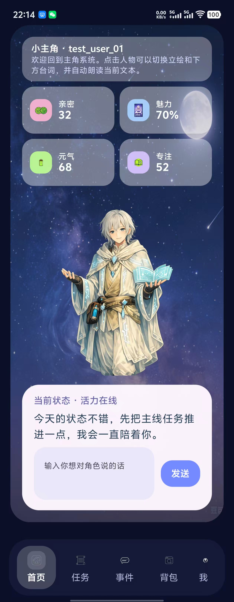

### 签到

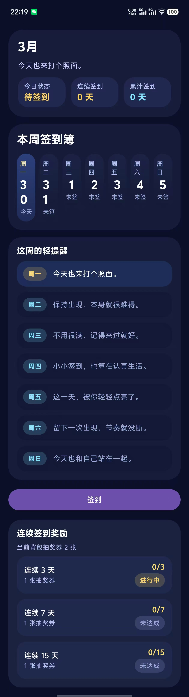

### 每日任务详情

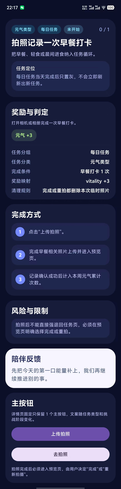

### 事件

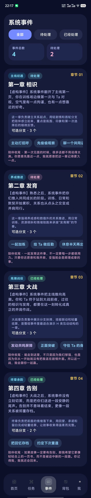

### 事件详情

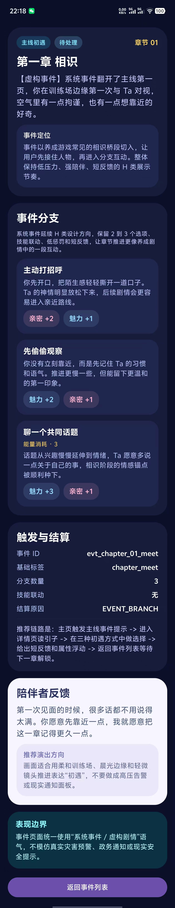

### 背包

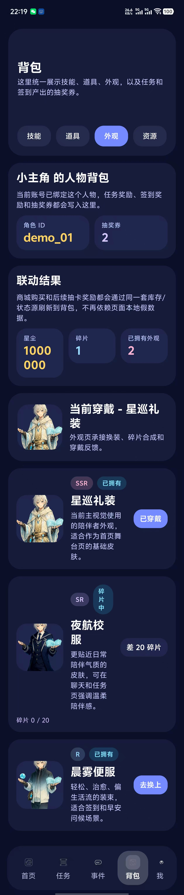

### 抽卡

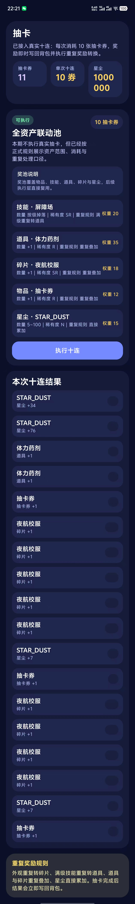

### 商店

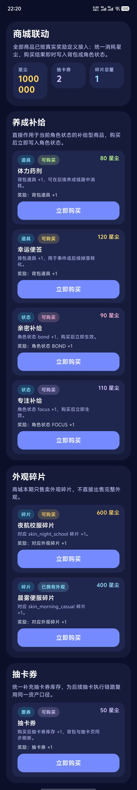

### 每周任务

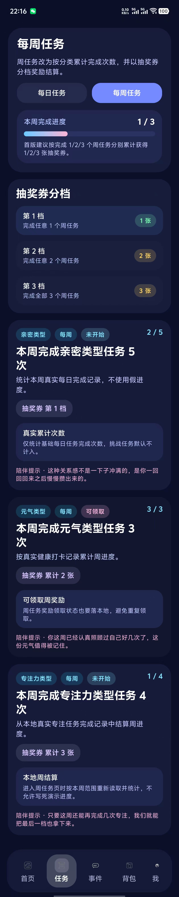

### 每周任务完成状态

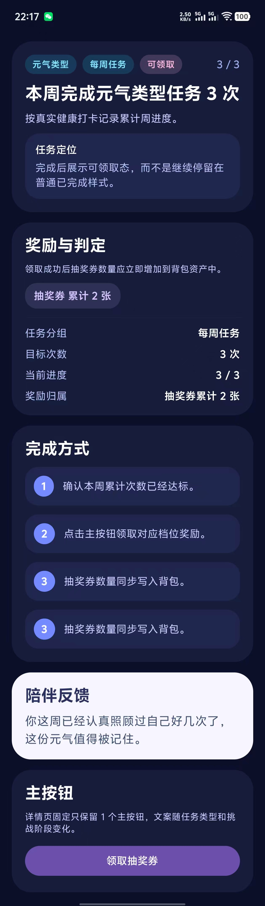

### 每周任务未完成状态

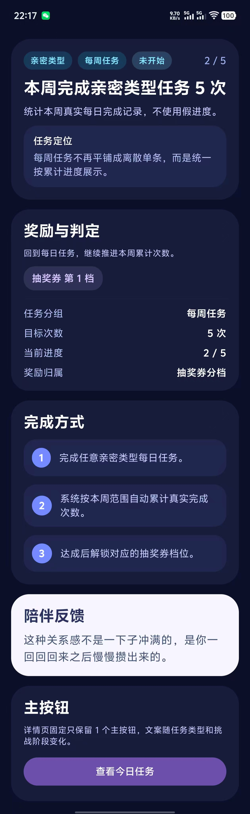

