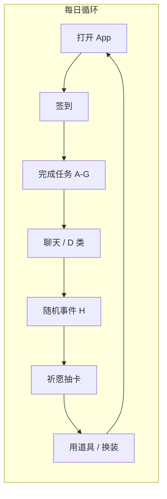
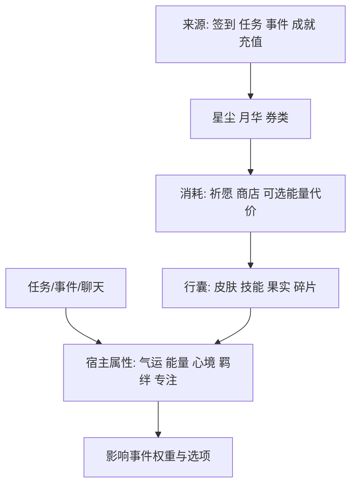

# 主角系统：游戏机制总纲（V1.1）

本文是**可扩充的机制中枢**：把属性、任务、随机事件、抽卡、皮肤、签到、技能与道具放在**同一套规则**下，保证数值来源可追溯、奖励派发可审计、新内容可只增配表而不改内核。

**与下列文档的关系**（细节不重复抄写，以交叉引用为准）：

| 文档 | 内容 |
|------|------|
| 《主角系统-需求整理》 | 愿景、合规边界、Demo 范围 |
| 《主角系统-配置扩表规范》 | **任务/奖励/事件等配表的字段格式、枚举、引用与校验**——扩内容优先只改配表 |
| 《主角系统-属性任务与抽奖细化》 | 属性语义、任务 A～H、抽奖奖池、事件叙事模板、防「瞎点完成」 |
| 《主角系统-界面与信息架构》 | 屏结构与用户路径 |

---

## 1. 系统目标与自洽标准

- **单源真相**：任意数值变化须能回答——**因什么系统、哪条配置、哪次用户行为**产生。
- **闭环**：用户行为 → **奖励与属性变化** → 解锁更多叙事/外观/事件权重 → 继续行为；**货币有出处、有消耗**，避免只产不消或只消不产。
- **可扩展**：新增任务模板、新事件 ID、新卡池行、新皮肤行，优先走**配置 + 注册表**，不复制粘贴逻辑。
- **可降级**：LLM、健康、识图等**可选模块**缺失时，核心循环仍可用（低配路径已在细化文档约定）。

---

## 2. 核心循环（宿主视角）



**资源流（简化）**



---

## 3. 概念模型（实现与配表共用一套词）

### 3.1 实体一览

| 实体 ID 前缀（建议） | 含义 | 持久化 |
|----------------------|------|--------|
| `HostState` | 宿主属性当前值、buff 列表、今日/本周累计器 | 本地或云端 |
| `Wallet` | 星尘、月华、各类券数量 | 同上 |
| `Inventory` | 技能卡实例、果实堆叠、皮肤拥有与装备、碎片、普通道具 | 同上 |
| `TaskInstance` | 某周期内刷出的任务条目 + 状态机 | 可日清周清 |
| `EventOffer` | 当前待展示的随机事件实例（含选项、冷却键） | 短期 |
| `SignInState` | 连续天、本月已签日期集合、上次结算日界 | 必须 |
| `GachaState` | 池子保底计数、历史拉取记录（审计） | 建议 |
| `CompanionPresentation` | 当前皮肤 ID、可选灵息条 | 展示层 |

### 3.2 统一「奖励包」与扩表格式（扩展点）

任意系统（任务完成、签到、事件分支、抽卡结果）只产出**同一种逻辑结构**，由 **RewardDispatcher** 执行；**配表侧**字段名、类型、引用关系、校验清单以 **《主角系统-配置扩表规范》** 为准。

**逻辑结构摘要**（与配置中的 `RewardBundleDef` 对应）：

```text
RewardBundle（运行时）
  currencies: map<currencyId, int>
  statDelta: map<statKey, int>      // 配置字段名；应用后 clamp
  items: [{ itemId, count, grantType }]
  buffs: [{ buffId, durationSec }]
  meta: { reasonCode, traceId }     // 运行时注入，不配在表内
```

**规则**

- 同一 `traceId` 的派发在网络重试下须**幂等**（签到、抽卡、购买尤其重要）。
- `reasonCode` 枚举以《配置扩表规范》§1.3 为准；**新增原因码**须同时更新白名单与埋点文档。

**扩内容约定**：新增任务/事件/签到档等**禁止**在任务行内联写星尘与属性；**必须先有或复用 `rewardBundleId`**，保证可追溯与复用。

---

## 4. 宿主属性子系统

### 4.1 属性集合（与细化文档一致）

| 键名（建议） | 展示名 | 刷新维度 |
|--------------|--------|----------|
| `FORTUNE` | 气运 | **日**：部分重置或衰减 |
| `VITALITY` | 能量 | **滚动**：自然回落 + 行为回升 |
| `MOOD` | 心境 | **滚动** |
| `BOND` | 羁绊 | **长期**：基本只涨 |
| `FOCUS` | 专注 | **周**：周一衰减或清零一段 |

### 4.2 数值管道（自洽规则）

1. **原始变化**：来自配置表中的 `statDelta`（任务/事件/签到等）。
2. **修饰层**：`buff`（果实、活动）按**加法或乘法**修饰（须在同文档定义一种主方案，建议：**任务奖励 +%** 用乘法，**展示用气运** 用加法上限夹逼）。
3. **夹逼**：每项均有 `[min, max]`，默认 `0～100`（羁绊若无限经验则另存 `bondExp` 再映射等级条）。
4. **日界/周界**：在**统一时钟服务**触发 `onDayRollover` / `onWeekRollover`，顺序：  
   `结算 buff 过期` → `应用气运日重置规则` → `刷新任务池` → `刷新签到 UI 状态`。

### 4.3 与陪伴者表现

- UI 只读 `HostState` + `buff` + `equippedSkinId` 推导**立绘姿态与台词包**；不在此文档展开美术表，只要求**映射表可配置**（如 `vitality < 30` → `pose_tired`）。

---

## 5. 货币与经济子系统

### 5.1 货币定义

| ID | 名称示例 | 主要来源 | 主要消耗 |
|----|----------|----------|----------|
| `STAR_DUST` | 星尘 | 任务、签到、事件、成就 | 普通祈愿 |
| `MOON_GLOW` | 月华 | 充值、活动 | 高级池、限定商店 |
| `GACHA_TICKET_*` | 单抽券等 | 签到、任务、活动 | 指定池 |

### 5.2 经济自洽

- **软通胀控制**：同日 A 类任务产星尘**递减**（见细化文档）；周常要求 B/C/F/G **多样性**才给大额包。
- **硬出口**：祈愿、商店皮肤、可选「事件选项付能量」；月华绑定付费与合规公示。
- **审计**：每次 `Wallet` 变更写 `ledger`（轻量可仅 Debug），便于查「为什么突然多了星尘」。

---

## 6. 任务子系统

### 6.1 任务类型注册表（可扩展）

| type | 处理器 key | 验证档 |
|------|------------|--------|
| A | `self_report` | none / optional_note |
| B | `timer` | app_timer |
| C | `health` | platform_health |
| D | `chat` | conversation_rounds |
| E | — | 见 §8 签到（或独立模块） |
| F | `photo` | image_scene |
| G | `voice` | voice_activity |
| H | `scripted_event` | in_app_choice |

新增类型时：增加 **handler + 配置 schema**，并在 `TaskTypeRegistry` 注册；**不**在业务里写死 `switch(字符串)` 超过一处。

### 6.2 任务状态机（统一）

```text
LOCKED → AVAILABLE → IN_PROGRESS → COMPLETED
                              ↘ VERIFYING → COMPLETED_VERIFIED（若存在验证档）
```

- **COMPLETED**：领取**基础奖励包**（自述路径）。
- **COMPLETED_VERIFIED**：额外派发 `TASK_VERIFY` 奖励包（星尘加成等）。
- **失败/放弃**：允许 `AVAILABLE` 重置（慎用；默认无惩罚，符合陪伴调性）。

### 6.3 任务配置字段

**完整字段表、示例 YAML、`handlerParams` 按类型扩展**见《主角系统-配置扩表规范》§3。

### 6.4 周常（与专注对齐）

- **周常任务**为独立 `taskGroup: WEEKLY`，与 `FOCUS` 在同一 `onWeekRollover` 清理进度。
- 大奖 `bundleId` 要求 `count(B|C|F|G verified) >= N`，配置在表，不写死在代码。

---

## 7. 签到子系统

### 7.1 状态

- `lastSignDate`：用户时区下的日历日。
- `streak`：连续自然日签到计数；**断签是否清零**可配（建议：**断签清零 streak，但不扣羁绊**）。
- `monthSignedBits` 或集合：用于展示日历 UI，**不作为强校验唯一源**（以 `ledger` 为准防改时钟）。

### 7.2 日界规则

- 以 **设备时区** 或 **账号偏好时区** 之一为唯一标准，全应用统一。
- `跨日` 第一件事：若未签，主页显示可领；**不自动偷签**（避免用户不知晓）。

### 7.3 奖励表（可扩充）

| 维度 | 配置方式 |
|------|----------|
| 按连续天 | `streak → bundleId` |
| 按自然月累计天 | `monthlyMilestone → bundleId` |
| 特殊日 | `calendarEventId → bundleId` |

签到奖励**只走** `RewardDispatcher`，`reasonCode=SIGN_IN`，保证与任务逻辑一致。

### 7.4 幂等

- 同一日历日多次请求签到 API：**返回成功但第二次 0 增量** 或 **明确错误码**，客户端以服务端为准（纯本地 Demo 可用 `signedToday` 布尔）。

---

## 8. 祈愿（抽卡）子系统

### 8.1 池子配置

- `poolId`、单次消耗（星尘/券）、权重表 `itemId → weight`、**保底规则**（如 N 抽必出稀有及以上）。
- 产出类型：`SKILL_CARD` `SKIN` `SKIN_SHARD` `FRUIT` `CURRENCY` `COSMETIC`。

### 8.2 抽取流程（自洽）

1. 校验货币 → 扣减（或券）→ **生成 roll 随机数**（服务端种子或客户端+上报二选一，上线建议服务端）。
2. 解析结果 → `Inventory` 变更（重复皮肤转碎片规则可表驱动）。
3. 派发 `RewardBundle`，`reasonCode=GACHA`，`traceId=pullId`。

### 8.3 与技能、皮肤联动

- **技能卡**：进 `Inventory.skills`，被动立即参与 **事件权重计算**（见 §10）。
- **皮肤**：进 `Inventory.skins` 或自动装备（可配）；**羁绊加成**若有，写在皮肤行 `bondBonusOnEquip`。

---

## 9. 皮肤子系统

### 9.1 数据

- `SkinDef`：`id` `rarity` `shardCost` `idleVariant` `bondBonus`（可选）。
- `equippedSkinId`：唯一；影响立绘与部分台词包。

### 9.2 获得路径

| 路径 | 说明 |
|------|------|
| 祈愿整卡 | 直接 `owned=true` |
| 碎片合成 | `shardCount >= shardCost` → 消耗碎片发皮肤 |
| 商店 | 月华/现金（合规） |
| 活动 | `bundle` 直发 |

### 9.3 扩展

- 新皮肤 = 新行 `SkinDef` + 资源包；**无需**改任务代码。

---

## 10. 技能卡与随机事件子系统（联动）

### 10.1 技能卡数据

- `SkillDef`：`id` `kind: passive|active|cosmetic` `eventTags[]` `cooldownSec` `weightModifiers`（被动）。
- `Inventory.skills`：拥有即 `unlocked`；主动技能带 `lastUsedAt`。

### 10.2 事件配置字段

叙事四段（引子 / 抉择 / 结果 / 收尾）与**字段级 schema**见《主角系统-配置扩表规范》§4；分支奖励一律 `rewardBundleId`。

### 10.3 触发管线（顺序固定，便于 debug）

1. **候选池**：当日未超 `maxEventsPerDay`，过滤 CD、标签、羁绊、**被动技能修饰权重**。
2. **加权抽样**：气运、被动技能改权重；**不得**出现全为 0 时强弹——应 fallback `default_idle_event`。
3. **展示**：生成 `EventOffer`，用户选分支 → 校验技能/CD → 派发奖励 → 记 `H` 类完成（若启用任务统计）→ `lastUsedAt` 更新。

### 10.4 与 H 类任务统计

- 配置 `countEventCompletionForWeekly: true` 时，事件结束写入周常计数器 `weekly.eventInteractions++`。

---

## 11. 道具（果实等）子系统

- `FruitDef`：`buffId` `duration` `maxStack`。
- **使用**：`Inventory` 扣 1 → `HostState.activeBuffs` 添加 → 通知 UI 与属性管道。
- **冲突策略**：同 `buffId` 刷新时长或叠加上限，**必须表驱动**，避免代码各写一套。

---

## 12. 隐藏计数与验证分

| 计数器 | 重置 | 用途 |
|--------|------|------|
| `daily.taskCompletionsByType` | 日 | A 类递减、风控 |
| `daily.verifiedTaskCount` | 日 | 周常、验证分 |
| `verificationScore` | 可日清或滚动 | 加码包门槛 |
| `gachaPityCounter[poolId]` | 出稀有重置 | 保底 |

---

## 13. 全局顺序与一致性（每日/每周）

**`onDayRollover`（建议顺序）**

1. 过期 buff 移除  
2. 气运日规则  
3. 日任务池刷新  
4. 签到「今日未签」状态  
5. 事件日计数清零  
6. 清理 `EventOffer` 过期实例  

**`onWeekRollover`**

1. 周常进度清零、发未领周常结算（若有）  
2. `FOCUS` 规则应用  

---

## 14. 模块可选与降级矩阵

| 模块缺失 | 行为 |
|----------|------|
| 健康权限 | C 类显示低配完成说明 |
| 相机/麦克风 | F/G 仅自述路径 |
| LLM | D 类改为固定句模板；事件收尾用模板句 |
| 云端 | 全流程本地 + 本地日界；注明无法同步 |

---

## 15. 配置与版本迁移

- 所有表带 `schemaVersion`；App 启动 `migrate(state, from, to)`。
- **Feature flag**：如 `focus.enabled` `gacha.pool.moon` 控制入口，避免半套功能暴露。

---

## 16. 风控与体验红线（机制层摘要）

- 随机事件、技能：**虚构玩法**，权重与文案不走「现实警报」通道（详见需求与细化文档）。
- 抽奖：**概率与适龄**独立合规页，与机制表 `weight` 同源展示。
- 不做「羁绊断崖惩罚」型机制绑定签到（可丢 streak，不扣 bond 大块）。

---

## 17. 落地检查清单（新内容上线前）

- [ ] 是否所有奖励经过 `RewardBundle` + `reasonCode`？  
- [ ] 新任务是否注册 `type` + handler，且声明验证档？  
- [ ] 新事件是否声明 `weightBase`、fallback、与技能 ID 一致？  
- [ ] 新池行是否更新保底与公示文案数据源？  
- [ ] 新皮肤是否声明碎片合成与 `equipped` 冲突处理？  
- [ ] 日界/周界是否触发该模块需要的重置钩子？  

---

## 18. 修订记录

- **V1.0**：首版总纲，串联属性、任务、事件、祈愿、皮肤、签到、技能与道具，并定义扩展与一致性强约束。
- **V1.1**：与《主角系统-配置扩表规范》对齐；§3.2、§6.3、§10.2 改为引用配表权威格式，避免双份 YAML 漂移。
